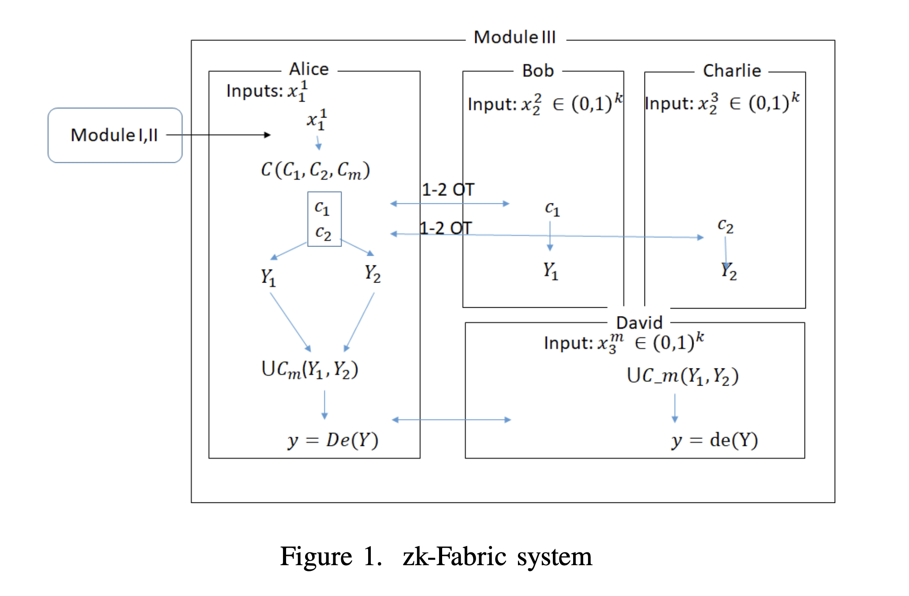

# zk-fabric-rs

a Polylithic Syntax Zero Knowledge Joint Proof System

## Module I: Polylithic Syntax Generation

```
Example of a composite statement:
`The car only starts [if] the "start" button [and] the brake pedal is pressed.`
where [.] represents logical relationship between variables (the rest of the words in composite statement).

This represents a logical condition where:
  S: Car starts
  P: "start" button is pressed
  B: brake pedal is pressed

It can be logically modeled as:
  (P ∧ B) → S  or  S → (P ∧ B)
depending on direction of implication.
```

Everything about it, what is Polylithic? How is it generation? pros, goals~, see the [PSG Wiki](wiki/psg.md).

## Module II: Partitioned Garbled Circuits

can be divided into three categories:-

| Component                | Role                                         | Who Uses It           | Security Goal                             |
| ------------------------ | -------------------------------------------- | --------------------- | ----------------------------------------- |
| A. Garbled Circuit       | Encrypt the logic of a function              | Alice (circuit owner) | Hide internal logic & intermediate values |
| B. Partitioned GC Scheme | Split the computation into verifiable parts  | Alice + Verifiers     | Allow distributed evaluation              |
| C. OT Protocol           | Provide input wire keys securely & privately | Bob/Charlie           | Keep input values secret from Alice       |

### A. Garbled circuit Representation

🎯 Sole Purpose:
To model a boolean function as a circuit of logic gates and convert it into an encrypted (garbled) format

✅ Outcome: A garbled version of the circuit that is secure and evaluable only by someone with the correct input keys.

### B. Partition Garbled Circuits Scheme

🎯 Sole Purpose:
To split the full garbled circuit into multiple smaller, independently evaluable partitions to support distributed verification and scalability.

✅ Outcome:
Enables parallel and distributed secure evaluation of large circuits by splitting trust and computation among multiple parties.

### C. Offline Non-Interactive OT Transfer Protocol

🎯 Sole Purpose:
To allow each verifier (e.g., Bob) to obtain exactly one of two possible input keys per wire (either for 0 or 1 input), without revealing their choice to Alice.

Outcome:
Enables private and secure acquisition of input wire keys so that verifiers can evaluate their partitions without leaking input choices or requiring live interaction.

### Status so far:

---

| Feature                    | Your Codebase | Paper Spec      |
| -------------------------- | ------------- | --------------- |
| Garbled circuit generation | ✅            | ✅              |
| Partitioning scheme        | ✅            | ✅              |
| Verifier evaluation        | ✅            | ✅              |
| Input wire key selection   | ⚠️ (direct)   | ❌ (must be OT) |

---

Understanding the concept, see the [PGC Wiki](wiki/pgc.md).

Note: For this prototype, we assume a trusted single-party execution where the evaluator already knows their inputs. We therefore skip the offline OT phase and directly assign wire keys as if the OT protocol has already been completed. In a full implementation, the OT protocol would be used to allow verifiers to retrieve only the keys corresponding to their inputs in a privacy-preserving way.

.

    Finished `dev` profile [unoptimized + debuginfo] target(s) in 0.84s
     Running `target/debug/zk-fabric`

✅ Dummy OT works! Bob received the correct key.

### Status So Far...

```
- PSG generates the boolean circuit with hashed variables and operators.
- The circuit is converted into your partitioned_gc::Circuit structure.
- Inputs get paired and prepared properly.
- Garbling assigns keys and garbles the gates correctly.
- Partitioning splits the circuit as expected.
- Protocol runs over the partitions and evaluates them.
- Outputs from partitions are aggregated, resulting in final verification [1] (true).
```

---

| Feature                     | Your Codebase    | Paper Spec             |
| --------------------------- | ---------------- | ---------------------- |
| Garbled circuit generation  | ✅               | ✅                     |
| Partitioning scheme         | ✅               | ✅                     |
| Verifier evaluation         | ✅               | ✅                     |
| Input wire key selection    | ✅ (dummy OT)    | ✅ (via OT)            |
| Offline non-interactive OT  | ❌ (mocked)      | ✅                     |
| Key publishing (DLT/public) | ❌ (skipped)     | ✅                     |
| Result verification & abort | ⚠️ (prints only) | ✅ (abort if mismatch) |

---

## Todo: Publish circuits + encrypted keys into a public_repo/ folder

### 

---

| Feature                     | Your Codebase    | Paper Spec             |
| --------------------------- | ---------------- | ---------------------- |
| Garbled circuit generation  | ✅               | ✅                     |
| Partitioning scheme         | ✅               | ✅                     |
| Verifier evaluation         | ✅               | ✅                     |
| Input wire key selection    | ✅ (dummy OT)    | ✅ (via OT)            |
| Offline non-interactive OT  | ❌ (mocked)      | ✅                     |
| Key publishing (DLT/public) | ✅ (simulated)   | ✅                     |
| Result verification & abort | ⚠️ (prints only) | ✅ (abort if mismatch) |

---

### Results can be found in 

## Module III: OT Aggregator Protocol

| Component     | Description                                                                                                                                                  |
| ------------- | ------------------------------------------------------------------------------------------------------------------------------------------------------------ |
| **Goal**      | Aggregate results $Y_1, Y_2, ..., Y_{m-1}$ from multiple garbled partitions using a lightweight XOR-based circuit $C_m$, and verify with aggregator (David). |
| **Form**      | Final circuit: $C_m(Y_1 \oplus X_1^m, Y_2 \oplus X_1^m, ..., Y_{m-1} \oplus X_1^m) \rightarrow Y$                                                            |
| **Output**    | Both Alice and David agree on final decoded $y$. If they mismatch → abort.                                                                                   |
| **Trustless** | David should verify without talking to Alice (non-interactive).                                                                                              |

---

# ZK-Fabric



The zk-Fabric system introduces a novel zero-knowledge proof framework capable of handling complex semantic computations efficiently. Its modular design and protocol construction make it well-suited for distributed computing environments such as blockchains and decentralized ledgers.

In this project, we have outlined and implemented the core modules and algorithms spanning from syntax parsing to partitioned garbled circuit execution, validating the practical feasibility of zk-Fabric’s approach.

Moving forward, our focus will be on prototyping and testing zk-Fabric in realistic environments to benchmark its computational and resource costs against existing secure computation technologies. Additionally, rigorous theoretical security analysis will be essential to further establish the robustness of zk-Fabric schemes.
