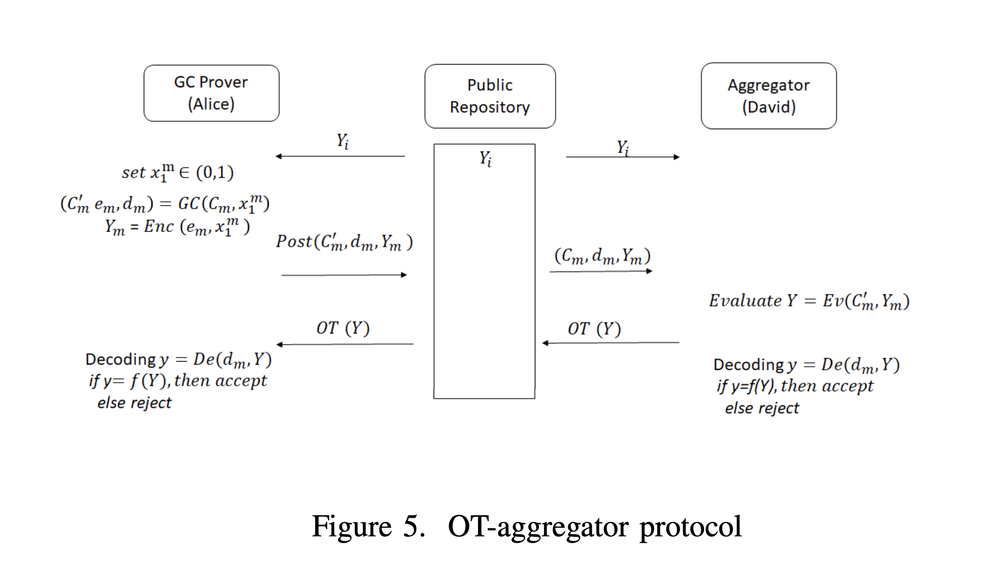

# OT Aggreator Protocol Step by Step

| Step   | Meaning                                                                               |
| ------ | ------------------------------------------------------------------------------------- |
| **1**  | David fetches verifier outputs $Y_i$ from public storage.                             |
| **2**  | Alice creates XOR mask $X_1^m$, derived from the previous garbled wire keys she used. |
| **3**  | Alice garbles a final XOR circuit $C_m$ to aggregate all $Y_i$.                       |
| **4**  | She encodes the XOR mask $X_1^m$ into garbled input $Y_m$.                            |
| **5**  | She publishes $(C_m^0, d_m, Y_m)$.                                                    |
| **6**  | David generates randomness $X_m^m$.                                                   |
| **7**  | He evaluates the circuit with that and gets output wire key.                          |
| **8**  | He publishes his output $Y$.                                                          |
| **9**  | Alice decodes the result.                                                             |
| **10** | Both check: is decoded output $y = f(Y_i \oplus X^m)$? If yes, verification passes.   |

.
