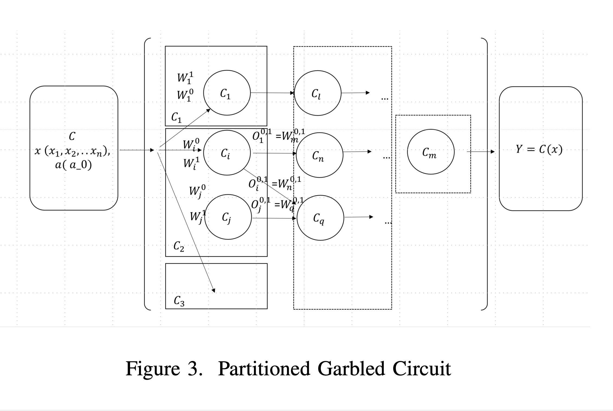

# Module II: Partitioned Garbled Circuits

> Reference: Yao's Garbled Circuits basics
> 
> Partitioning scheme for splitting circuits into multiple independent garbled circuits
> Ensures privacy and correctness via cryptographic commitments.

### Brief

- A garbled circuit is a method to "encrypt a computation",
- that reveals only the output of the computation,
- but reveals nothing about the inputs or any intermediate values.
- The "circuit" is referred to a combination of logical operations on inputs and
- The syntax is expressed as a Boolean circuit with
- The Boolean gates, such as (AND, OR, NOT) gates in the circuit.

> Yao's
> 1 (Garbler): comprises of a method to convert a (plain) circuit 𝐶 into a garbled circuit 𝐶ˆ.
> 2 (Encoder) comprises of a method to convert any (plain) input 𝑥 for the circuit into a garbled input 𝑥ˆ. You need the secret randomness that was used to garble the circuit
> to encode 𝑥 into 𝑥ˆ.
> 3 (Verifier) comprises of a method to take a garbled circuit 𝐶ˆ and garbled input 𝑥ˆ and compute the circuit output 𝐶(𝑥). Anyone can do this, you don’t have to know 𝑥 or the secret randomness inside 𝐶ˆ to evaluate and learn 𝐶(𝑥).

**The main idea of security is that 𝐶ˆ and 𝑥ˆ together leak no more information than 𝐶(𝑥).**

## Our Goal

Securely divide the table into multiple representation of the truth table matrix `T`.

## Understanding the Concept

### 1. Boolean Circuit Representation

The Boolean circuit can be represented as a Directed Acyclic Graph (DAG) with fixed 2-input gates (left `l` and right `r` inputs).

The circuit has depth d (number of layers) and width n (number of gates per layer).

Representing it as a matrix `M` of dimension `d × n` where each element is a gate as it is convinient in defining the composition of layers.

### 2. Partitioned Garbled Circuits (PGCs)

The circuit `C` can be partitioned into smaller sub-circuits `(C1, C2, ...)` each independently garbled.

**This allows multi-party OT verification protocols to run verification and privacy checks independently on parts of the circuit.**

_The garbled truth tables (or garbled gate tables) are split accordingly._

### 3. Correctness

> To obtain the security properties of such scheme,
> it can be proved with [state-separating proofs](https://eprint.iacr.org/2021/1453.pdf) and
> to make cryptographic proofs more suitable for multi-parties verification.

For security parameter `k`, garbling and evaluation satisfy:

- `∀(C,e,d)` in garbling scheme `Gc(1^k,C)` and input `x`,
- `De(d, Ev(C, En(e,x)))` = `C(x)`,
  meaning, _decoding the evaluation result yields the correct circuit output._

## Input

| Input to Partitioned Garbled Circuit Scheme | Description                                      |
| ------------------------------------------- | ------------------------------------------------ |
| Circuit `C`                                 | Boolean circuit structure (DAG, matrix of gates) |
| Input bits `x_1, ..., x_n`                  | Prover and verifier inputs bits                  |
| Auxiliary bits `a_0, a_1` (if needed)       | Random padding bits if odd inputs                |
| Truth tables `T` per gate                   | Defines gate logic for garbling                  |

## To do

- You pass the Boolean circuit 𝐶 , C as a data structure (list of gates with their inputs and outputs)
- The input values 𝑥 , x as bit arrays or boolean vectors matching input wires

## Implementation

easier to understand in three stages,

### Preparation

- inputs : `x1,x2,...,xn` where x denote multi-party Yao's Garbled Circuit in a sorted sequence
- pair two sorted inputs together onto one boolean gates

  - if odd inputs then addition of two auxiliary random values `𝑎0, 𝑎1 ∈ {0, 1}`
    > _"In a trust setup, the auxiliaries will have to destroyed at the "toxic wastes" after being used."_

  `𝐶'(𝑥1, ..., 𝑥𝑛) = 𝐶( (𝑥1, 𝑥2), ...(𝑥𝑛−1, 𝑥𝑛))` {if n is even}
  `= 𝐶( (𝑥1, 𝑥2), ...(𝑥𝑛, (𝑎0 ⊕ 𝑎1))` {if n is odd}

### Construction

- for each input pairs (𝑥𝑖 , 𝑥𝑗) {where 𝑥𝑖 are input from prover and 𝑥𝑗 input from verifier}
  - the wires and internal wires 𝑤 of the circuit, assign a pair of keys (𝑘^0𝑤 , 𝑘^1𝑤).
- for each gate of the circuit,
  - generate 4 ciphertexts which
  - encrypts the corresponding key associated with the output wire
    according to the truth table of the table `T`
    
- for each gate connected to an output wire of the circuit
  - encode 0/1 according to the truth table

### Partitioning

_based on the Truth table 𝑇_,

- partition the circuit matrix 𝑀 horizontally to the penultimate gate before the last aggregating gates.
  The partitioning of garbled circuit needs some extra care _to maintain the inputs/outputs integrity_.
- implement the partitioning with 𝑛/1 (fan-in / fan-out) ratio
  > In partitioning with an n/1 fan-in/fan-out ratio,
  > you're essentially dividing a large task or dataset into smaller, manageable chunks (n)
  > that are then processed by a single entity or system (1).
  > Specifically, the 𝑛/1 scheme requires that the leftmost input gates are partitioned per garbled logical gate, and after the first tier of inputs, the intermediate and last tier gates are aggregated into **one garbled circuit**.
- add the partitioned garbled circuit (𝐶1, 𝐶2, ...𝐶𝑚) and
- run the iterations of garbled circuit protocol per circuit.
  ```
  //this sub-step runs in iterations.
  Alice (prover) runs the Non-interactive multiple parties OT transfer scheme
  per partitioned circuit with multiple verifiers offline
  to obtain the partitioned garbled circuit verification
  `𝑌𝑖 = 𝐶𝑖(𝑥𝑖, 𝑥𝑗)`, except the last circuit 𝐶𝑚.
  ```
- for circuit 𝐶𝑚,
  - it’s required to employ the module III 𝑂𝑇 − 𝑎𝑔𝑔𝑟𝑒𝑔𝑎𝑡𝑜𝑟
  - to obtain the combined Oblivious Transfer verification
    `𝑌 = 𝐶𝑚(𝑥𝑚) = Ð𝑚−1 𝑖=1 𝐶𝑖(𝑥𝑖, 𝑥𝑗)`

The scheme uses these to:

- Pair inputs into 2-input gates
- Assign wire keys
- Generate garbled tables per gate
- Partition the circuit into smaller garbled circuits
- Run oblivious transfers on each partitioned circuit



## Result

#### main.rs

add the below snippet in main,

```
// Step 3: Convert PSG BooleanCircuit to partitioned_gc::Circuit for garbling
    //
    // For demonstration, we create a dummy circuit with simple gates
    // based on the number of gates in PSG output (usually you'd parse PSG output precisely)
    let circuit = Circuit {
        depth: 2,
        width: 2,
        gates: vec![
            Gate { gate_type: GateType::And, left_wire: 0, right_wire: 1, output_wire: 2 },
            // Add more gates here if needed, matching boolean_circuit.gates.len()
        ],
        input_wires: vec![0, 1],
        output_wires: vec![2],
    };

    println!("\n[Main] Converted to partitioned_gc::Circuit:\n{:#?}", circuit);

    // Step 4: Prepare inputs for partitioned GC protocol (example inputs)
    let inputs = vec![1, 1]; // start button pressed = 1, brake pressed = 1
    let paired_inputs = PartitionedGCScheme::prepare_inputs(inputs);

    // Step 5: Garble circuit
    let garbled_circuit = PartitionedGCScheme::garble_circuit(&circuit);

    // Step 6: Partition the garbled circuit (set partition size as 1 gate for demonstration)
    let partitions = PartitionedGCScheme::partition_garbled_circuit(&garbled_circuit, 1);

    // Step 7: Run protocol iterations over partitions (stub)
    PartitionedGCScheme::run_protocol_iterations(&partitions);

    // Step 8: Aggregate verification result (stub)
    let verification = PartitionedGCScheme::aggregate_verification(&partitions);

    println!("\n[Main] Final verification output: {:?}", verification);
```


**Output**

```
--- Polylithic Syntax Generation Complete ---

[Main] PSG generated boolean circuit:
BooleanCircuit {
    gates: [
        "circuit((cced28c6dc3f99c2396a5eaad732bf6b28142335892b1cd0e6af6cdb53f5ccfa) && (876797249822df52fd57ad8a506093acec21dd5967cad35984af03762560b906))",
    ],
}

[Main] Converted to partitioned_gc::Circuit:
Circuit {
    depth: 2,
    width: 2,
    gates: [
        Gate {
            gate_type: And,
            left_wire: 0,
            right_wire: 1,
            output_wire: 2,
        },
    ],
    input_wires: [
        0,
        1,
    ],
    output_wires: [
        2,
    ],
}
[Prepare Inputs] Paired Inputs: [(1, 1)]
[Garble Circuit] Assigned keys to wires and garbled 1 gates.
[Partition] Created partition with gates 0 to 0
[Run Protocol] Starting protocol iterations over 1 partitions.
[Run Protocol] Evaluating partition 1 with 1 gates.
[Aggregate Verification] Combining outputs from partitions.

[Main] Final verification output: [1]
```
