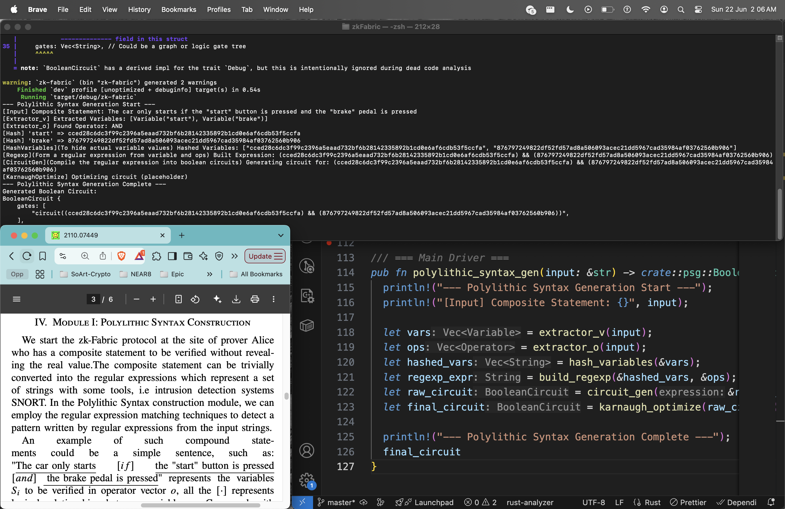

# Module 1 : Polylithic Syntax Generation

> transform a full semantic statements from a prover into a polylithic syntax logical expression with boolean operations.
> _Polylithic is created in comparision with "Monolotihic"_  
> _Polylithic_ ~ **a circuit made of many smaller logical component**  
> i.e **components** , map to boolean variables and logical operators extracted from structured text or policy logic(e.g, IDS tools, SNORT)

### Problem

Alice wantes to prove "_a composite statement is true_" ,
**without revealing the actual** values of variables.

### Statement

Example of a composite statement with natural language rule:
`The car only starts [if] the "start" button [and] the brake pedal is pressed.`
where [.] represents logical relationship between variables (the/any rest of the word(s) in composite statement).

### Reperesenation

Conditional and Logical Language rule respectively:

This represents a logical condition where:
S: Car starts
P: "start" button is pressed
B: brake pedal is pressed

It can be logically modeled as:
(P ∧ B) → S or S → (P ∧ B)
depending on direction of implication.

### Pro

Compared with native zk-proof system which can only process single(monolithic) variable at a time, zk-fabric aim to match the regular expression with patterns and contruct corresponding circuits with reduced complexity.

### Goal

Extracting [quoted strings] as variables and logic keywords like [and] as Boolean operators.

### Result

#### main.rs

```
mod psg; // import the psg module

use crate::psg::polylithic_syntax_gen;

fn main() {
    let input = r#"The car only starts if the "start" button is pressed and the "brake" pedal is pressed"#;

    let circuit = polylithic_syntax_gen(input);

    println!("Generated Boolean Circuit:\n{:#?}", circuit);
}
```



**Output**

```
--- Polylithic Syntax Generation Start ---
[Input] Composite Statement: The car only starts if the "start" button is pressed and the "brake" pedal is pressed
[Extractor_v] Extracted Variables: [Variable("start"), Variable("brake")]
[Extractor_o] Found Operator: AND
[Hash] 'start' => cced28c6dc3f99c2396a5eaad732bf6b28142335892b1cd0e6af6cdb53f5ccfa
[Hash] 'brake' => 876797249822df52fd57ad8a506093acec21dd5967cad35984af03762560b906
[HashVariables](To hide actual variable values) Hashed Variables: ["cced28c6dc3f99c2396a5eaad732bf6b28142335892b1cd0e6af6cdb53f5ccfa", "876797249822df52fd57ad8a506093acec21dd5967cad35984af03762560b906"]
[Regexp](Form a regular expression from variable and ops) Built Expression: (cced28c6dc3f99c2396a5eaad732bf6b28142335892b1cd0e6af6cdb53f5ccfa) && (876797249822df52fd57ad8a506093acec21dd5967cad35984af03762560b906)
[CircuitGen](Compile the regular expression into boolean circuits) Generating circuit for: (cced28c6dc3f99c2396a5eaad732bf6b28142335892b1cd0e6af6cdb53f5ccfa) && (876797249822df52fd57ad8a506093acec21dd5967cad35984af03762560b906)
[KarnaughOptimize] Optimizing circuit (placeholder)
--- Polylithic Syntax Generation Complete ---
Generated Boolean Circuit:
BooleanCircuit {
    gates: [
        "circuit((cced28c6dc3f99c2396a5eaad732bf6b28142335892b1cd0e6af6cdb53f5ccfa) && (876797249822df52fd57ad8a506093acec21dd5967cad35984af03762560b906))",
    ],
}
```
